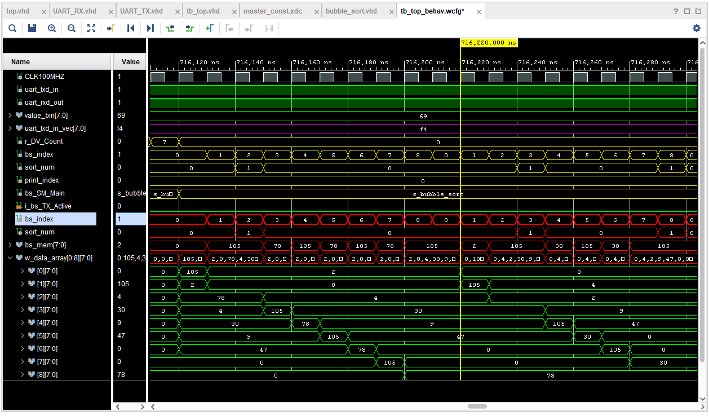

# MAPD

Report Link
https://docs.google.com/document/d/1EJJN3XJ_mkAiht6wNu8KGTtxN7CD8tFgyw4jDVgbSSU/edit

Working Project Files  
https://drive.google.com/drive/folders/1M4TWb5W8i1z79NP6K7Ux169w9BsUr5-O?usp=sharing  
 
Important for everyone to watch this so they can understand the design of the code 

UART VIDEO
https://www.youtube.com/watch?v=Vh0KdoXaVgU

Simulation set up 

My drive folder share link

https://drive.google.com/drive/folders/1Z0kCZoW8L592DAKeTI74q2IeYicK0AAL?usp=sharing

Walters Drive link

https://drive.google.com/drive/folders/1dASbZEi4LeBrDj1fY94hjEhq4YMwwaAf

Our board will be either

xc7a35tcsg324-1 or xc7a100tcsg324-1

Other resources
http://freerangefactory.org/pdf/df344hdh4h8kjfh3500ft2/free_range_vhdl.pdf

Constraint master file

https://github.com/Digilent/digilent-xdc/blob/master/Arty-A7-35-Master.xdc

https://github.com/Digilent/digilent-xdc/blob/master/Arty-A7-100-Master.xdc

Git (keeping it simple, can add personal dev branches if need be) 

git pull 
git push -u origin master

lectures merged together
https://drive.google.com/file/d/1P3LB5ojx_66RQ6HVGliAnE0oEJpF-Wg7/view?usp=sharing

Pin Maps and board info:
https://digilent.com/reference/programmable-logic/arty-a7/reference-manual

How to look at internal signals in a test bench
Hi Daniel,

in simulation you can look at all the internal signals, not only at the ports on the top.
In the tab "Scope" you should find a hierarchy of the simulation entities. There is the top entity of the testbench and then the DUT and also other instances in case there are other components inside the DUT. If you click on a particular component (for instance on DUT) you should find in the window "Object" all the list of internal signals of that component. Then you can drag and drop a signal on the waveform window under the column "Name". Finally you can relaunch the simulation clicking on the icon with the circular arrow.
I hope to have been clear. In case I was not, please let me know.

Best,

Tasks for mapd

   0.  Alter Jake’s code so it works with arrays of different sizes.
I will do this tonight. 

1. Write a python script that compares a python bubble sort, np.sort() and the fpga bubble sort in terms of speed. With graphs of number of items to be sorted vs time taken to sort. Also include versions of the fpga stats with and without transfer time. Transfer time = 868clock cycles per bit*10ns per bit*8bits per byte*N bytes(items to be sorted)*2(for transmission and reception)  ns
2. Write about the findings in the report:
    1. Results section, statement of the results and show graphs. 
    2. conclusion section, about wether or not it is worth performing the algorithm on the fpga vs the computer.

Maybe… Me and Jake do above. Mariam Walter and Khadija do below, That way everyone has an understanding of the code for when we come to answer questions on it.

1. Draw a schematic of the project components transmitter, receiver bubble sort, how they are linked together. Include them all as a single entity and how the entire entity is linked to the clock and tx / rx of the board. How this links into the constraints file.
2. Present and explain code in the report. Transmitter, receiver, bubble sort, (maybe, test bench) - Including what a state machine is. Explain the function of each state in the code. Not needed to explain each line of code or function used. 
